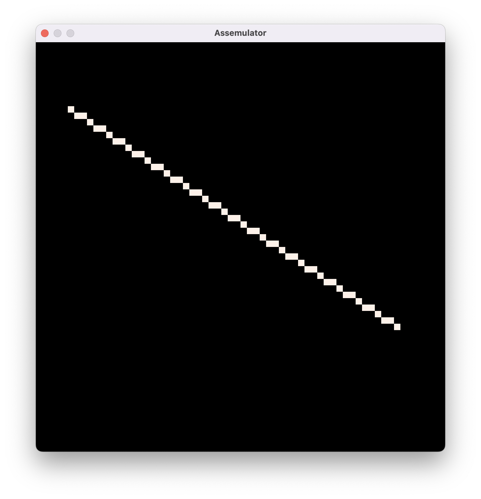

# Assemulator

Assemulator is a framework I built to help me design, assemble, and emulate instruction sets.

Historically, I would write a custom assembler for each CPU I was working on. I wanted a more generic tool so I wouldn't have to implement the same functionality each time.

Adding support for an instruction set is done by implementing three functions (defined and documented [here](src/cpus/mod.rs))

```rust
fn new(pc: u64, program: Vec<u8>, data: Vec<u8>) -> Self;
fn parse_tokens(tokens: Vec<Token<Self::Opcode, Self::Reg>>, address: u64) -> Result<Vec<u8>, String>;
fn step(&mut self) -> usize;
```

By doing so, you get a fully-featured assembler and emulator.

## Assembler features

- Labels
- Immediate, relative, and direct addressing modes
- Constants (hex, binary, decimal, chars, strings)
- Directives (constants, set, fill, align)
- Anonymous labels
- Helpful error messages
- [Documentation](./docs/assembler.md) (WIP)


## Emulator features

- Real-time user input for games via 6 buttons (arrow keys and ZX)
- Prompt user input from stdin
- Print char and int to stdout
- Generate random numbers
- Bitmap screen
- 200MHz+ emulation speed


## Features planned / in progress

- Fixed-point constants (i0.8, i5.3, i8.16, i32.32, etc.)
- Macros
- Function scopes
- Step debugging
- Other things listed [here](TODO.md)


# Current CPUs

The generality of the framework has been demonstrated by implementing a variety of instruction sets, including

- Bit-twiddler: a 16-bit ISA, 8-bit data, two-operand CPU
- [RiSC-16](https://user.eng.umd.edu/~blj/risc/): 16-bit instruction, 16-bit data, three-operand CPU
- Mira: an 8-bit ISA, 8-bit data, accumulator CPU

I'm still working on porting some of my other CPUs.

# Examples

Insertion sort running on bit-twiddler

```shell
$ cargo run --release -- bit-twiddler ./src/cpus/bit_twiddler/programs/insertion_sort.asm run

Program: 40 bytes
Data: 5 bytes
-----------------
1
2
3
4
5
```

Bresenham running on bit-twiddler

```shell
$ cargo run --release -- bit-twiddler ./src/cpus/bit_twiddler/programs/wip/bresenham.asm run

Program: 98 bytes
Data: 0 bytes
-----------------
```

